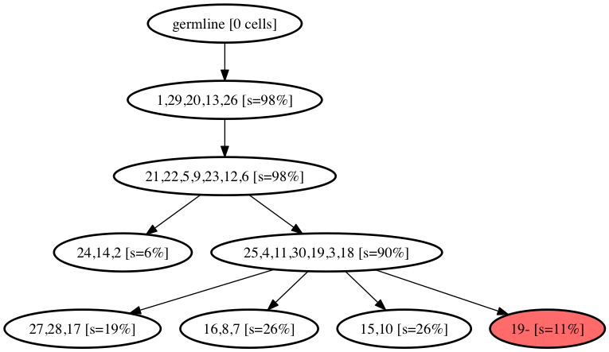
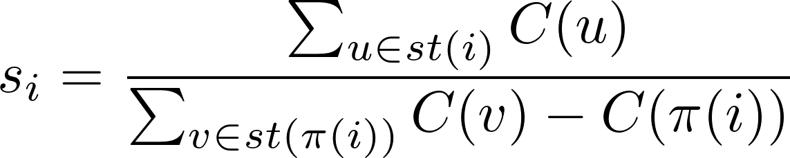

Simulated Annealing Single Cell inference (SASC) tool -- cancer progression inference
===================

SASC is  a new model and a robust framework based on Simulated Annealing for the inference of cancer progression from the SCS data.
The main objective is to overcome the limitations of the Infinite Sites Assumption by introducing a version of the k-Dollo parsimony model which indeed allows the deletion of mutations from the evolutionary history of the tumor. 

<!-- A detailed description of the framework can be found in published version of the paper [Inferring Cancer Progression from Single Cell Sequencing while allowing loss of mutations](#). -->

Compile
--------

SASC can be downloaded and compiled easily using the following commands:
```bash
git clone https://github.com/sciccolella/sasc.git
cd sasc
make
```

Input Files
-------------

**Single Cell file**

The input file (specified by the `-i` parameter) is expected to be a ternary matrix file where the rows represent the cells and the columns the mutations. Each cell must be separated by a space or by a tab (`\t`). Each cell of the matrix can be:

| Value of cell | Meaning |
| ------------- | ------------- |
| I[i,j] = 0    | Mutation *j* is not observed in cell *i*  |
| I[i,j] = 1    | Mutation *j* is observed in cell *i*  |
| I[i,j] = 2    | There is no information for mutation *j* in cell *i*, i.e. low coverage  |

An example of the input file can be seen in [MGH36_scs.txt](data/real/MGH36/MGH36_scs.txt).

**Mutations file**

This optional file specifies the name of the mutations (parameter `-e`). Each mutation's name must be on a different line (separated by `\n`), and the names are assigned to columns from left to right in the input file. If this file is not provided, mutations are progressively named from `1` to the total number of mutations.

An example of the mutations' name file can be seen in [MGH36_snv-names.txt](data/real/MGH36/MGH36_snv-names.txt).

**Cells file**

This optional file specifies the name of the cells (parameter `-E`). Each cell's name must be on a different line (separated by `\n`), and the names are assigned to rows from top to bottom in the input file. If this file is not provided, cells are progressively named from `1` to the total number of cells.

An example of the mutations' name file can be seen in [MGH36_cell-names.txt](data/real/MGH36/MGH36_cell-names.txt).

**FN rates file**

This optional file specifies the false negative rate of the mutations (parameter `-a`). Each mutation's FN rate must be on a different line (separated by `\n`), and the rates are assigned to columns from left to right in the input file. If this file is not provided, it is necessary to select a single float value that will be interpreted as the FN rate for each mutation.

An example of the mutations' name file can be seen in [MGH36_fn-rates.txt](data/real/MGH36/MGH36_fn-rates.txt).
A single FN rate can be specified directly when running the program, e.g. `-a 0.3`.

**Prior losses file**

This optional file specifies the prior loss probability of the mutations (parameter `-g`). Each mutation's prior must be on a different line (separated by `\n`), and the probabilities are assigned to columns from left to right in the input file. If this file is not provided, it is possible to select a single float value that will be interpreted as the prior loss probability for each mutation. If the value is not provided it will be set to 1 by default.

An example of the mutations' name file can be seen in [gammas.txt](examples/gammas.txt).
A single FN rate can be specified directly when running the program, e.g. `-g 0.01`.


Usage
----------

**Input Parameters (required)**

- `-n [INT]`: Number of cells in the input file.
- `-m [INT]`: Number of mutations in the input file.
- `-k [INT]`: K value of Dollo(k) model used as phylogeny tree.
- `-a [FLOAT/STRING]`: False Negative rate in the input file or path of the file containing different FN rates for each mutations.
- `-b [FLOAT]`: False Positive rate in the input file.
- `-i [STRING]`: Path of the input file.

**Model parameters (optional)**
- `-d [INT]`: Maximum number of total deletions allowed in the solution. By default the value is set to have no restriction (+INF).
- `-e [STRING]`: Path of the mutations' name file. If this parameter is not used then the mutation will be named progressively from `1`.
- `-E [STRING]`: Path of the cells' name file. If this parameter is not used then the cells will be named progressively from `1`.
- `-g [FLOAT/STRING]`: Loss rate in the input file or path of the file containing different GAMMA rates for each mutations.
- `-r [INT]`: Set the total number of Simulated Annealing repetitions. Default is 5.
- `-M`: Force sasc to infer a monoclonal tree, i.e. a tree with only one node child of the germline. Default is not set.

**Output parameters (optional)**
- `-l`: If this flag is used SASC will output a mutational tree with cells attached to it. Ortherwise cells will not present. Please note that this flag is needed if you plan to run the visualization tool afterwards.
- `-x`: If this flag is used, SASC will additionally output the expected matrix E.

**Simulated Annealing parameters (optional)**
- `-S [FLOAT]`: Starting temperature of the Simulated Annealing algorithm.
- `-C [FLOAT]`: Cooling rate of the Simulated Annealing algorithm.
- `-p [INT]`: Total number of cores to be used by the tool.

**Error learning  parameters (optional)**
- `-B [FLOAT]`: Standard deviation for new FP discovery. [Disabled by default.]
- `-A [FLOAT]`: Standard deviation for new FN discovery. [Disabled by default.]
- `-G [FLOAT]`: Standard deviation for new GAMMA discovery. [Disabled by default.]

Output
---------
SASC has three different output formats that can be toggled with different arguments.

**Mutational Tree**

This is the standard output; SASC will generate a mutational tree in DOT format with no cells attached as leaves of the tree. An example of this output is shown in [MGH36 mutational tree](examples/MGH36_scs_mlt_mutations_only.gv).

**Mutational Tree with cells as leaves**

By toggling option `-l` SASC will instead output a mutational tree in DOT format with cells attached as leaves of the tree. An example can be found at [MGH36 mutational tree with cells](examples/MGH36_scs_mlt.gv).

**Expected Matrix**

In addition to the previous formats SASC can output the expected matrix *E* such in [MGH36 expected matrix](examples/MGH36_scs_out.txt) using the `-x` flag.

Usage examples
--------
SASC can then be run using the previously described parameters. Here we show a list of run and their results.

**Childhood Lymphoblastic Leukemia (patient 4)**
```bash
./sasc -i data/real/gawad/pat4.txt -m 78 -n 143 -a 0.3 -b 0.001 -k 3 -d 5 -e data/real/gawad/pat4_mut.txt 
```

The command specifies a Dollo-3 phylogeny with a maximum of 5 deletions in the tree, a single FN rate of `0.3`, no prior loss probability (default to `1`) and mutations names specified in the file `data/real/gawad/pat4_mut.txt`.

**MGH36 with different FN rates and monoclonality**

```bash
./sasc -i data/real/MGH36/MGH36_scs.txt -m 77 -n 579 -a data/real/MGH36/MGH36_fn-rates.txt -b 0.005 -k 0 -e data/real/MGH36/MGH36_snv-names.txt -E data/real/MGH36/MGH36_cell-names.txt -l -x -r 1 -M
```
The command specifies a Perfect Phylogeny (Dollo-0) with FN rates detailed in file `data/real/MGH36/MGH36_fn-rates.txt`, mutation names in `data/real/MGH36/MGH36_snv-names.txt`, cell names in `data/real/MGH36/MGH36_cell-names.txt`, output of mutational tree with cells as leaves (`-l`), output of the expected matrix (`-x`) and a total of 1 repetition (`-r 1`).

**Simulation with different FN rates and Prior values and Error Learnign**
```bash
./sasc -i data/simulated/exp6-bimod/sim_21_scs.txt -m 50 -n 200 -k 1 -d 3 -a examples/alphas.txt -g examples/gammas.txt -b 0.0003 -A 0.2 -G 0.05
```

The command specifies a Dollo-1 phylogeny with a maximum of 3 deletions in the tree, FN rates detailed in `examples/alphas.txt`, prior loss probabilities in `examples/gammas.txt`, learning standard deviation of `0.2` for FN rate (`-A 0.2`) and learning standard deviation of `0.05` for prior loss (`-G 0.05`).

SASC-viz (Visualization tool)
=============================

The script `SASC-viz.py` can be used as a visualization tool and to apply operation to `SASC`'s output without needing to re run the tool. The tool will change the output of the tool only for visualization purposes. **Please note that you have to run SASC with the `-l` flag in order to use the tool.**

Usage
----------

```bash
python3 SASC-viz.py [-h] -t TREE [-E CELLNAMES | -n TOTCELL] [--show-support]
              [--show-color] [--collapse-support COLLAPSE_SUPPORT]
              [--collapse-simple] [--sep SEP]
```

**Input files required**

- `-t TREE`: path to the input file, i.e. `SASC`'s output (run with the `-l` flag).

You are required to use either:
- `-E CELLNAMES`: path to the mutation labels file (this is the same file used with the flag `-E` on `SASC`).
- `-n TOTCELLS`: instead of the previous argument, if the mutation labels are not specified, you must provide the number of cells in the input (this is the same option used with `-n` with `SASC`).

**Supported operations (optional)**

- `--collapse-simple`: when this option is activated, all
    simple non-branching paths are collapsed, i.e. if a node has only one child, then such node is merged with its child.
- `--show-support`: show the _mutation support_ of each node.
- `--collapse-support THRESHOLD`: if the support of a node _x_ is lower than the specified `THRESHOLD`, then _x_ is merged with its parent. This operation is performed in a bottom-up fashion starting from the leaves.
- `--show-color`: if this flag is used, the nodes will be colored using a gradient scale from red to green based on the support.
- `--sep STRING`: if this option is used the labels on the nodes will be separetad by `STRING`. Default is `,`.

**Output**

The tool will output a tree in DOT format, which can be converted into a picture using either the program `dot` or the web interface available on [webgraphviz.com](http://www.webgraphviz.com/).

Usage example
----------------

Run `SASC-viz` on the MGH36 dataset, run with the parameters used in the previous example.

```bash
python3 SASC-viz.py -t examples/MGH36_scs_mlt.gv -E data/real/MGH36/MGH36_cell-names.txt --collapse-simple --collapse-support 20 --show-support
```
Output:

```
digraph phylogeny {
	node [penwidth=2];
	"0" [label="germline [255 cells]"];
	"0" -> "1";
	"1" [label="IDH1,NOTCH2,RTTN,TBC1D10A,MLYCD,CACNA1G,CTNNA2,NRN1,APC2,IL33,NBPF10,RFX3,UBE2Z,ZZEF1,KHSRP,SH3BP5,CCDC181,VGLL4,PIK3CA,PHLDB3,NR3C1,RP11-356C4.3,VPS9D1,PLEKHM1,LINC00937,ST8SIA3,CPEB4,TRPM3,TRIOBP,ZNF451,CEP55,TFAP2A,ZNF721,KIF2A,USP36,IFT81,SVEP1,MCM8,ARHGEF3,AGAP2,NR5A2 [s=100%]"];
	"1" -> "23";
	"23" [label="CEBPZ,DGCR6L,MAN1B1,ENO3,ZNF526 [s=76%]"];
	"23" -> "25";
	"25" [label="MIR4477B,KMT2C,SLC26A11,ORC3,CLEC18B,KAT6A,CNNM2,SLC16A7 [s=100%]"];
	"25" -> "27";
	"27" [label="PCDHA1 [s=28%]"];
	"27" -> "28";
	"28" [label="HELZ2,RIN2 [s=50%]"];
	"27" -> "30";
	"30" [label="TXNDC2,HEATR4 [s=25%]"];
	"27" -> "32";
	"32" [label="NPEPL1 [s=25%]"];
	"25" -> "33";
	"33" [label="EEF1B2,ZNF462,EP400,RP11-403I13.8 [s=71%]"];
	"1" -> "46";
	"46" [label="HLA-DQB2,ABCA7,STXBP1,RUNX2,SOX5,KIAA0907,CPAMD8 [s=23%]"];
	"46" -> "47";
	"47" [label="ANKRD30B,FAM182B,TRPM2,AS3MT [s=25%]"];
	"46" -> "52";
	"52" [label="EMR2,CYP27A1 [s=75%]"];
}
```

Run `SASC-viz` to produce directly a PDF file containing the tree. This requires `dot` to be installed.

```bash
python3 SASC-viz.py -t examples/simulated_mlt.gv -n 50 --collapse-simple --collapse-support 5 --show-support | dot -Tpdf > tree.pdf
```
Output:



Definition of mutation support
-----------------------------
The support  _s<sub>i</sub>_ of a mutation _i_ is computed on the _n x m_ inferred matrix _E_ as follows.
Let  _pr(i)_ be the set of nodes in the path from the root to _i_ let _st(i)_ be the set of nodes in the subtree rooted in _i_, and let _C(i)_ be the number of cells assigned to the node _i_. Then the mutation support _s<sub>i</sub>_ is:


<p align="center">

</p>